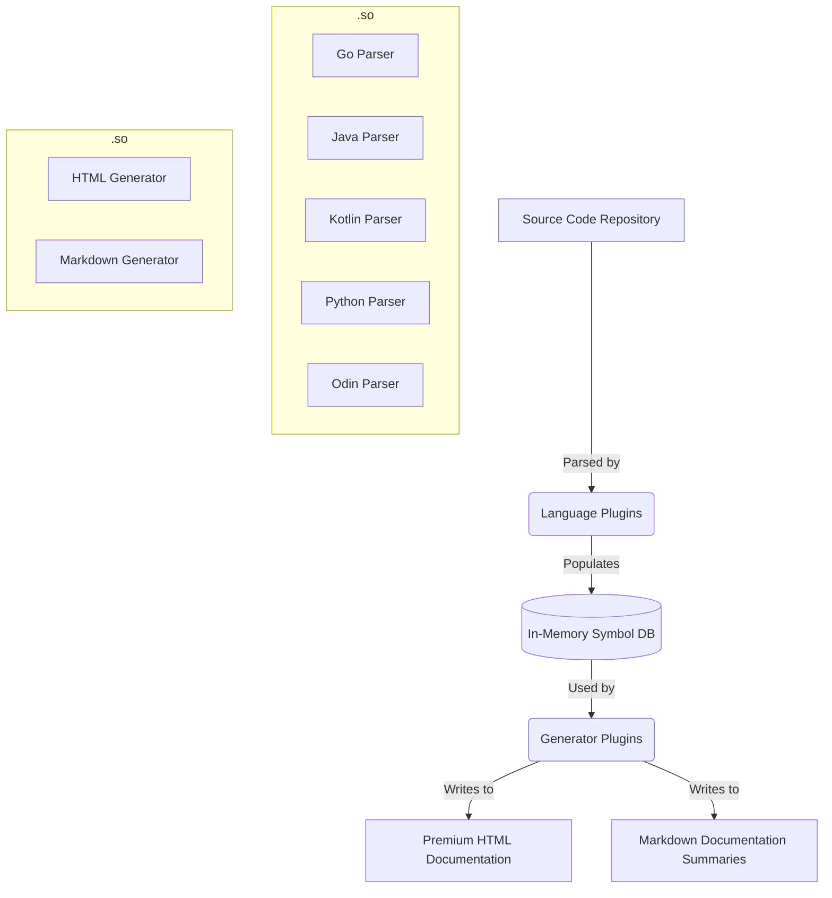

# Self-Documenting Go Parser with Call Graphs

A high-performance, configuration-driven, and pluggable documentation generator that parses source code across multiple programming languages and compiles interactive visual relationship graphs, sequence diagrams, and class hierarchies.

Powered by **Tree-Sitter** grammar parsing, a **Go in-memory normalized symbol database**, and **dynamic Shared Object (.so) plugins**, this generator can produce stunning, premium HTML and structured Markdown summaries in a single, parallelized pass.

---

## 🚀 Key Features

* **Dynamic Plugin Architecture**: Parsers and generators are compiled as dynamic shared libraries (`.so`), decoupling the core engine from specific languages or presentation formats.
* **Multi-Language Support**: Fully parsed via Tree-Sitter grammars:
  - **Go**: Full struct, interface, function, and method call graph parsing.
  - **Java**: Full package, class, interface, method, and call relationship extraction.
  - **Kotlin**: Parenthesis-aware, constructor-resilient class/interface inheritance parsing.
  - **Python**: Modular class, function, and call graph analysis.
  - **Odin**: Robust procedure and structure documentation.
  - **Markdown**: Custom parsed static guides.
* **Premium Interactive Visualizations**: Automatically compiles:
  - **Type Relationship Graphs**: Struct inheritance, interfaces implementation, and composition.
  - **Sequence Diagrams**: Complete call execution paths across packages and files.
  - **Timing Diagrams**: Object state transitions and lifecycles.
* **Performance Optimizations**:
  - **Parallel Concurrency**: Fully configurable thread pools (`concurrency` option).
  - **MD5-Based Image Caching**: Hashing diagram content to avoid regenerating unchanged images—making rebuilds on massive repositories instantaneous.
  - **Smart scope capping**: Intelligently caps sequence, timing, and type diagrams to the most crucial 15 instances to avoid CPU exhaustion on enterprise codebases.

---

## 🏗️ Architecture



### Core Components

1. **Store DB (`pkg/store/source.go`)**: Acts as a normalized, queryable database holding registered files, call relations, and symbols (classes, interfaces, methods, etc.).
2. **Engine (`cmd/generate/main.go`)**: Reads TOML configurations, dynamically loads `.so` parser plugins, crawls target repositories, populates the store, runs the diagram pipeline, and triggers output generator plugins.
3. **Diagram Provider (`pkg/diagram/provider.go`)**: Leverages local PlantUML or Graphviz installations to compile high-fidelity PNG representations of program flows.

---

## 🛠️ Getting Started

### Prerequisites

* **Go 1.21+**
* **Graphviz** (requires `dot` in PATH)
* **PlantUML** (requires `plantuml` in PATH)

### Compilation

Build all parser and generator plugins as shared objects using:

```bash
make plugins
```

This compiles all dynamic plugins under `plugins/parsers/` and `plugins/generators/`.

---

## ⚙️ Configuration (`.toml` structure)

Create a configuration file (e.g., `docgen.toml` or `hadoop.toml`) to specify parallelization, target repositories, and multiple concurrent output formats:

```toml
concurrency = 12

[input]
directory = "../my-project"
ignore = [
    ".git",
    "target",
    "test"
]

[[output]]
format = "html"
directory = "docs/my-project"

[[output]]
format = "markdown"
directory = "docs/my-project_md"
```

To run the documentation generator with your configuration:

```bash
go run cmd/generate/main.go -config docgen.toml
```

---

## 🔌 How to Author New Plugins

This system is fully customizable and extendable. You can add new parsers (input plugins) or generators (output plugins) without recompiling the core executable.

### 1. Adding a Parser Plugin

A parser plugin must be compiled as a standalone Go package called `main` and export two global variables: `Parser` (implementing `store.Parser`) and `Extensions` (a slice of file extensions it handles).

#### Step-by-Step Implementation:

1. Create a directory: `plugins/parsers/my_lang/`
2. Create a `main.go` file:

```go
package main

import (
	"doc_generator/pkg/store"
)

// Define your parser implementing store.Parser
type MyLangParser struct{}

func (p *MyLangParser) Parse(filePath string, fileContent []byte, source *store.Source) error {
	// Parse the file content (e.g., using Tree-Sitter)
	// Populate symbols and calls in the source DB:
	// source.AddFile(filePath)
	// source.AddSymbol(store.Symbol{...})
	return nil
}

// Export the required symbols
var Parser store.Parser = &MyLangParser{}
var Extensions = []string{".mylang"}
```

3. Compile your parser:

```bash
go build -buildmode=plugin -o plugins/parsers/mylang_parser.so plugins/parsers/my_lang/main.go
```

The core generator will automatically load your `.so` plugin if it matches the `.mylang` file extension during scanning.

---

### 2. Adding a Generator Plugin

A generator plugin must be compiled as a standalone Go package called `main` and export two global variables: `Generator` (implementing `store.Generator`) and `Format` (a string identifying the output format name).

#### Step-by-Step Implementation:

1. Create a directory: `plugins/generators/my_format/`
2. Create a `main.go` file:

```go
package main

import (
	"doc_generator/pkg/store"
	"os"
	"path/filepath"
)

type MyFormatGenerator struct{}

func (g *MyFormatGenerator) Generate(source *store.Source, outputDir string) error {
	_ = os.MkdirAll(outputDir, 0755)
	// Traverse source.Symbols and source.Calls to write structured documentation
	// e.g., JSON, YAML, custom PDF, etc.
	return nil
}

// Export the required symbols
var Generator store.Generator = &MyFormatGenerator{}
var Format = "myformat"
```

3. Compile your generator:

```bash
go build -buildmode=plugin -o plugins/generators/myformat_generator.so plugins/generators/my_format/main.go
```

To use it, simply define a block in your `.toml` configuration:

```toml
[[output]]
format = "myformat"
directory = "docs/output_myformat"
```

---

## 📄 License

This project is licensed under the **MIT License**.
